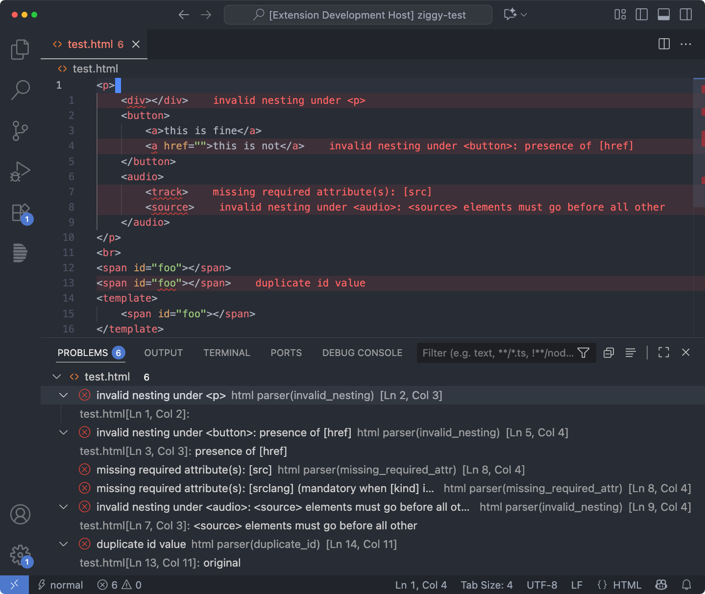

# SuperHTML VSCode LSP
Language Server for HTML.

# IMPORTANT: disable the builtin VSCode HTML extension!
Due to a bug in VSCode's builtin HTML extension, SuperHTML cannot disable wrong
end tag suggestions from VSCode automatically.
You can still disable them manually by following [these instructions](https://github.com/kristoff-it/superhtml/issues/107).


## Diagnostics
SuperHTML validates not only syntax but also element nesting and attribute values.
No other language server implements the full HTML spec in its validation code.




## Autoformatting

The autoformatter has two main ways of interacting with it in order to request for horizontal / vertical alignment.

1. Adding / removing whitespace between the **start tag** of an element and its content.
2. Adding / removing whitespace between the **last attribute** of a start tag and the closing  `>`.

Note that the autoformatter will never accept any configuration option. You are encouraged to add a `superhtml fmt --check` step to your CI to guarantee that you only commit normalized HTML files.

### Example of rule #1
Before:
```html
<div> <p>Foo</p></div>
```

After:
```html
<div> 
    <p>Foo</p>
</div>
```

#### Reverse

Before:
```html
<div><p>Foo</p>
</div>
```

After:
```html
<div><p>Foo</p></div>
```

### Example of rule #2
Before:
```html
<div foo="bar" style="verylongstring" hidden>
    Foo
</div>
```

After:
```html
<div foo="bar" 
     style="verylongstring" 
     hidden
>
    Foo
</div>
```

#### Reverse

Before:
```html
<div foo="bar" 
     style="verylongstring"
     hidden>
    Foo
</div>
```

After:
```html
<div foo="bar" style="verylongstring" hidden>
    Foo
</div>
```

## This extension bundles the full language server

But you can optionally also get the CLI tool so that you can access it outside of VSCode.
For prebuilt binaries and more info: https://github.com/kristoff-it/superhtml

